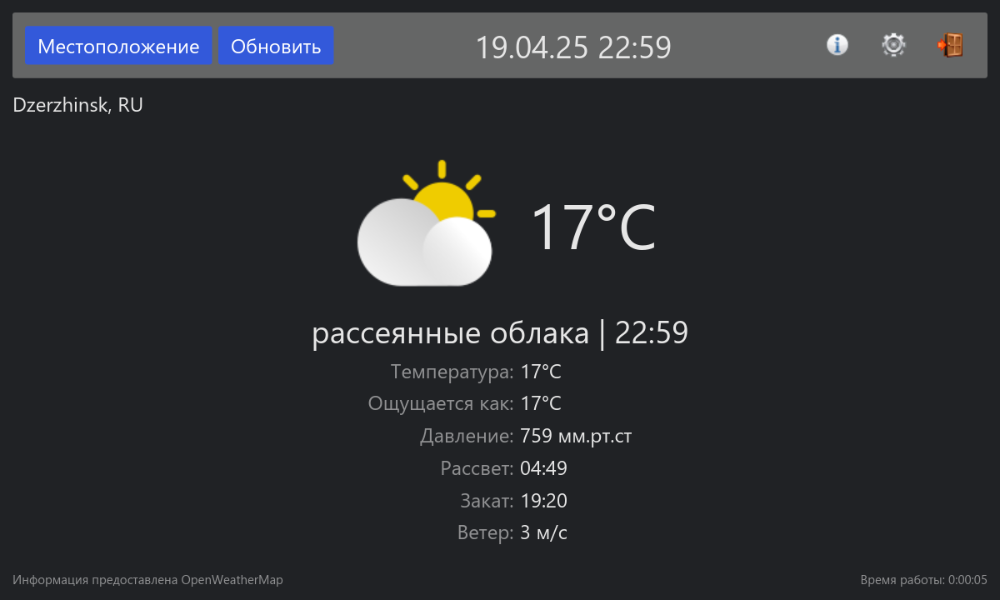

# ice

ice is simple and stupid full-screen program to get information about weather in the specified location. Originally written for my OrangePi 3 LTS SBC.



## Functions

1. Display information about weather in the specified location.
2. ...
3. That's all.

## Technology stack

- **OS:** Linux;
- **Programming language:** Rust;
- **Interface:** Iced;

## Build and install

### Dependencies

- **Build:**
  - `git`, `musl`/`glibc`, `cargo`, `rustc`, `gcc`;
- **Run:**
  - `rust-stdlib`, Xorg/Wayland;

### Local build

```bash
git clone https://mskrasnov/ice
cd ice

cargo build --release
sudo cp -v ./target/release/ice /usr/bin/
```

> **Note:** you can use preinstalled display manager (e.g. LightDM, SDDM, GDM, etc.).

## License

ice is distributed under the MIT license.

## Support me

You can support the developer of this program by creating issue or pull request. Also if you from Russia you can send me donation:

> 2202206252335406 (Михаил Сергеевич)
